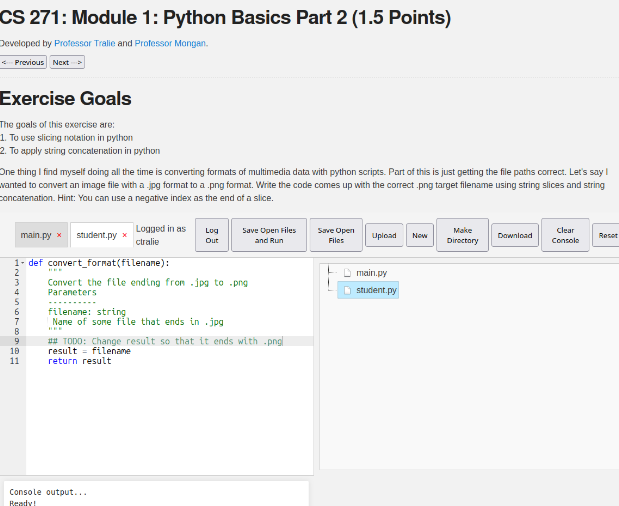

# The Ursinus WebIDE

Christopher Tralie and William Mongan

As a response to emergency remote teaching during the pandemic, we developed an online “live coding” modules system back in 2020, where students write code in a web page where they can run their code, and it is automatically graded. We have been using this extensively across the entire CS curriculum ever since as a “low stakes” medium to teach and reinforce knowledge scaffold up to more difficult assignments. Since the modules run in the browser, they are highly accessible cross-platform without any software installation necessary. The system is also setup to be “client side” on static web pages, which means that the code the students are exploring runs on student’s computers, making the system much easier and cheaper to maintain; in fact, this even enables us to make the exercises available to anyone on the internet at no additional cost. 

Our system addresses the following goals that we had in providing rapidly developed, low-stakes, frequent practice problems for our students, that have continued to enhance the student experience in the post-pandemic classroom:

1. Create a unified code template across all languages we currently support (C++, Java, Javascript, WebGL, Python, Numpy, R, SQL.
2. Remember students netid in a cookie so they don’t have to keep entering it, and add functionality to save/load code if they want to return to it.
3. Devise a simpler way to communicate with Canvas that is easier to maintain.
4. Setup a more intuitive file browser in the module web pages that shows students what files they can edit for each module.  Mirror the filesystem experience they would expect on their local computers to help scaffold a tree-based filesystem.
5. Handle infinite loops that students accidentally create in a more graceful way (currently this freezes up the browser).
6. Provide the illusion of a filesystem within the web development interface that provides students with experience and confidence in using modern development tools and non-mobile filesystems.
7. Seamlessly display multimedia assets within the environment, such as images and audio, to support courses that entail multimedia development and processing.
8. Provide low-stakes automated feedback to students by automatically detecting common mistakes and providing feedback in a more authentic “console-like” window
9. Save student work within the browser, so that students can review their work at a later time by revisiting the exercise page.
10. Perform all of the above without requiring student installation of software beyond an off-the-shelf web browser, regardless of operating system or computing environment constraints; specifically, software modules function on lower-end systems such as Chromebooks.  This is especially helpful as an equity assurance for students who add the class late and need time to install requisite software, and for students who suffer technology breakdowns during the semester.
11. Provide an archive of and automatic grading of student submissions that can connect to learning management systems (LMS) in an encrypted, FERPA-complaint way.

These modules engage students and get them to think about topics outside of class in a much more active way than if we simply assigned readings, particularly with instant feedback we give them that often includes hints relevant to the mistakes they make. The modules are also very dynamic and flexible, so there are lots of exercises we can do with multimedia, etc. The infrastructure also serves as a backup option the first couple of weeks of class while students are still getting software setup on their own computers. Finally, there is a subset of students who have consistently told us that they get more out of these than class because they can go through them at their own pace, and we often use them to keep students on track who are traveling for sports, etc.  Since these are freely available open source online, anyone on the internet can try them.  An example of the student interface is shown below:



## Installation Instructions

1. Fork this repository, and set up Github pages to get a URL.
2. Create assignments in the `_pages/` directory (details about how to do this are provided below).  To get started, simply add and clone our submodule of exercises into your `_pages` directory via `git submodule add https://github.com/BillJr99/Ursinus-Exercises _pages/Exercises` to use our pre-made exercises available at [https://github.com/BillJr99/Ursinus-Exercises](https://github.com/BillJr99/Ursinus-Exercises)!
3. Proceed to the Configuration section below to set a few global parameters for linking to your Learning Management System (LMS)
4. Fork and/or Download the Form Processor ([https://github.com/BillJr99/formprocessor/](https://github.com/BillJr99/formprocessor/)) to configure a Google form/spreadsheet to receive student submissions from the WebIDE front-end, and to post grades and submissions to your LMS in a FERPA-compliant way.  Instructions for configuring the Form Processor can be found on that repository.

## Basic Configuration

In `config.yml`, edit the variables to suit your preferences.  Specifically, be sure to set the following parameters:

```
publickey: |  
  YOUR PUBLIC KEY HERE
```

`canvascourseid: courseid1, courseid2, courseid3`  

`formlink: LINK TO GOOGLE SHEET FOR FORM PROCESSING HERE`  

If desired, these variables can be overrided on a per-assignment or per-page basis from the global values configured here:

* `publickey` can be overridden in the layout 
* `canvascourseid` can be overridden in the exercise page
* `formlink` can be overriden in the layout 

## Backend Form Processor for Posting Grades
Use this WebIDE front-end with the formprocessor back-end (available at [https://github.com/BillJr99/formprocessor/](https://github.com/BillJr99/formprocessor/)) to pull from google sheets

## Example Exercises

This repository contains examples for various programming languages. Each example is linked below, organized by language.

### CS1 and CS2

#### **Java**
- [CS173: Intro to Computer Science - ArrayLists](http://www.billmongan.com/Ursinus-WebIDE/Modules/ArrayLists/Exercise) ([source](https://raw.githubusercontent.com/BillJr99/Ursinus-Exercises/refs/heads/main/Java/exercise-arraylists.md))
- [CS173: Intro to Computer Science - Nearest Value in an Array without Going Over](http://www.billmongan.com/Ursinus-WebIDE/Modules/Arrays/Exercise) ([source](https://raw.githubusercontent.com/BillJr99/Ursinus-Exercises/refs/heads/main/Java/exercise-arrays.md))
- [CS173: Intro to Computer Science - Introduction to Boolean Expressions](http://www.billmongan.com/Ursinus-WebIDE/Modules/Boolean/Exercise) ([source](https://raw.githubusercontent.com/BillJr99/Ursinus-Exercises/refs/heads/main/Java/exercise-boolean.md))
- [CS173: Intro to Computer Science - Introduction to Conditionals](http://www.billmongan.com/Ursinus-WebIDE/Modules/Conditionals/Exercise) ([source](https://raw.githubusercontent.com/BillJr99/Ursinus-Exercises/refs/heads/main/Java/exercise-conditionals.md))
- [CS173: Intro to Computer Science - Dynamic Programming](http://www.billmongan.com/Ursinus-WebIDE/Modules/DynamicProgramming/Exercise) ([source](https://raw.githubusercontent.com/BillJr99/Ursinus-Exercises/refs/heads/main/Java/exercise-dynamicprogramming.md))
- [CS173: Intro to Computer Science - Epoch Time Overflow Calculator](http://www.billmongan.com/Ursinus-WebIDE/Modules/EpochTime/Exercise) ([source](https://raw.githubusercontent.com/BillJr99/Ursinus-Exercises/refs/heads/main/Java/exercise-epoch.md))
- [CS173: Intro to Computer Science - Introduction to Primitive Data Types and Expressions](http://www.billmongan.com/Ursinus-WebIDE/Modules/Expressions/Exercise) ([source](https://raw.githubusercontent.com/BillJr99/Ursinus-Exercises/refs/heads/main/Java/exercise-expressions.md))
- [CS173: Intro to Computer Science - Introduction to Primitive Data Types and Expressions Revisited](http://www.billmongan.com/Ursinus-WebIDE/Modules/Expressions/Exercise2) ([source](https://raw.githubusercontent.com/BillJr99/Ursinus-Exercises/refs/heads/main/Java/exercise-expressions.md))
- [CS173: Intro to Computer Science - Four in a Row](http://www.billmongan.com/Ursinus-WebIDE/Modules/FourInARow/Exercise) ([source](https://raw.githubusercontent.com/BillJr99/Ursinus-Exercises/refs/heads/main/Java/exercise-fourinarow.md))
- [CS173: Intro to Computer Science - Functions](http://www.billmongan.com/Ursinus-WebIDE/Modules/Functions/Exercise) ([source](https://raw.githubusercontent.com/BillJr99/Ursinus-Exercises/refs/heads/main/Java/exercise-functions.md))
- [CS173: Intro to Computer Science - Introduction to the NetBeans IDE](http://www.billmongan.com/Ursinus-WebIDE/Modules/IDE/Exercise) ([source](https://raw.githubusercontent.com/BillJr99/Ursinus-Exercises/refs/heads/main/Java/exercise-ide.md))
- [CS173: Intro to Computer Science - Insertion Sort](http://www.billmongan.com/Ursinus-WebIDE/Modules/InsertionSort/Exercise) ([source](https://raw.githubusercontent.com/BillJr99/Ursinus-Exercises/refs/heads/main/Java/exercise-insertionsort.md))
- [CS173: Intro to Computer Science - Introduction to Iteration](http://www.billmongan.com/Ursinus-WebIDE/Modules/Iteration/Exercise) ([source](https://raw.githubusercontent.com/BillJr99/Ursinus-Exercises/refs/heads/main/Java/exercise-iteration.md))
- [CS173: Intro to Computer Science - Iteration Revisited](http://www.billmongan.com/Ursinus-WebIDE/Modules/Iteration/Exercise2) ([source](https://raw.githubusercontent.com/BillJr99/Ursinus-Exercises/refs/heads/main/Java/exercise-iteration.md))
- [CS173: Intro to Computer Science - Merge Sort](http://www.billmongan.com/Ursinus-WebIDE/Modules/MergeSort/Exercise) ([source](https://raw.githubusercontent.com/BillJr99/Ursinus-Exercises/refs/heads/main/Java/exercise-mergesort.md))
- [CS173: Intro to Computer Science - Problets and Epplets](http://www.billmongan.com/Ursinus-WebIDE/Modules/Problets/Exercise) ([source](https://raw.githubusercontent.com/BillJr99/Ursinus-Exercises/refs/heads/main/Java/exercise-problets.md))
- [CS173: Intro to Computer Science - Recursion](http://www.billmongan.com/Ursinus-WebIDE/Modules/Recursion/Exercise) ([source](https://raw.githubusercontent.com/BillJr99/Ursinus-Exercises/refs/heads/main/Java/exercise-recursion.md))
- [CS173: Intro to Computer Science - Strings](http://www.billmongan.com/Ursinus-WebIDE/Modules/Strings/Exercise) ([source](https://raw.githubusercontent.com/BillJr99/Ursinus-Exercises/refs/heads/main/Java/exercise-strings.md))
- [CS173: Intro to Computer Science - Strings Revisited](http://www.billmongan.com/Ursinus-WebIDE/Modules/Strings/Exercise2) ([source](https://raw.githubusercontent.com/BillJr99/Ursinus-Exercises/refs/heads/main/Java/exercise-strings.md))
- [CS173: Intro to Computer Science - Tic-Tac-Toe](http://www.billmongan.com/Ursinus-WebIDE/Modules/TicTacToe/Exercise) ([source](https://raw.githubusercontent.com/BillJr99/Ursinus-Exercises/refs/heads/main/Java/exercise-tictactoe.md))
- [CS173: Intro to Computer Science - Horstmann Parsons Puzzle: Swap (from Horstmann)](http://www.billmongan.com/Ursinus-WebIDE/Modules/Horstmann/Swap/Exercise) ([source](https://raw.githubusercontent.com/BillJr99/Ursinus-Exercises/refs/heads/main/Horstmann/exercise-swap.md))
- [CS174: OOP - Drills - Array 3 Sort](http://www.billmongan.com/Ursinus-WebIDE/ArrayDrills/Array3Sort) ([source](https://raw.githubusercontent.com/BillJr99/Ursinus-Exercises/refs/heads/main/Java/exercise-drill-array3sort.md))
- [CS174: OOP - Drills - Array Insert](http://www.billmongan.com/Ursinus-WebIDE/ArrayDrills/ArrayInsert) ([source](https://raw.githubusercontent.com/BillJr99/Ursinus-Exercises/refs/heads/main/Java/exercise-drill-arrayinsert.md))
- [CS174: OOP - Drills - Computing the mean of arrays](http://www.billmongan.com/Ursinus-WebIDE/ArrayDrills/ArrayMean) ([source](https://raw.githubusercontent.com/BillJr99/Ursinus-Exercises/refs/heads/main/Java/exercise-drill-arraymean.md))
- [CS174: OOP - Drills - Array Min Index](http://www.billmongan.com/Ursinus-WebIDE/ArrayDrills/ArrayMinIndex) ([source](https://raw.githubusercontent.com/BillJr99/Ursinus-Exercises/refs/heads/main/Java/exercise-drill-arrayminindex.md))
- [CS174: OOP - Drills - Creating the reverse of an array](http://www.billmongan.com/Ursinus-WebIDE/ArrayDrills/ArrayReverse) ([source](https://raw.githubusercontent.com/BillJr99/Ursinus-Exercises/refs/heads/main/Java/exercise-drill-arrayreverse.md))
- [CS174: OOP - Drills - Printing array with commas](http://www.billmongan.com/Ursinus-WebIDE/ArrayDrills/ArraySep) ([source](https://raw.githubusercontent.com/BillJr99/Ursinus-Exercises/refs/heads/main/Java/exercise-drill-arraysep.md))
- [CS174: OOP - Drills - Counting Array Zeroes](http://www.billmongan.com/Ursinus-WebIDE/ArrayDrills/ArrayZeroes) ([source](https://raw.githubusercontent.com/BillJr99/Ursinus-Exercises/refs/heads/main/Java/exercise-drill-arrayzeroes.md))
- [CS174: OOP - Drills - Vowel Counting](http://www.billmongan.com/Ursinus-WebIDE/MiscDrills/StringVowels) ([source](https://raw.githubusercontent.com/BillJr99/Ursinus-Exercises/refs/heads/main/Java/exercise-drill-stringvowels.md))

#### **C++**
- [C++ Basics](http://www.billmongan.com/Ursinus-WebIDE/Modules/Cpp/CppIntro) ([source](https://raw.githubusercontent.com/BillJr99/Ursinus-Exercises/refs/heads/main/cpp/exercise-cppintro.md))

#### **Javascript**
- [Javascript Example Module: Array Min Index](http://www.billmongan.com/Ursinus-WebIDE/Modules/Javascript/MinIndex) ([source](https://raw.githubusercontent.com/BillJr99/Ursinus-Exercises/refs/heads/main/Javascript/exercise-minindex.md))

#### **Python**
- [CS377: Database Design - Iteration in Python](http://www.billmongan.com/Ursinus-WebIDE/Modules/Python/Iteration/Exercise) ([source](https://raw.githubusercontent.com/BillJr99/Ursinus-Exercises/refs/heads/main/Python/exercise-python-iteration.md))
- [CS377: Database Design - Quadratic Formula in Python](http://www.billmongan.com/Ursinus-WebIDE/Modules/Python/Warmup/Exercise) ([source](https://raw.githubusercontent.com/BillJr99/Ursinus-Exercises/refs/heads/main/Python/exercise-python-quadratic.md))
- [CS 271: Module 1: Python Basics Part 2](http://www.billmongan.com/Ursinus-WebIDE/Modules/Python/Slice/Exercise) ([source](https://raw.githubusercontent.com/BillJr99/Ursinus-Exercises/refs/heads/main/Python/exercise-python-slice.md))
- [CS 372: Module 2: Square Wave](http://www.billmongan.com/Ursinus-WebIDE/Modules/Pyodide/AudioSquareWave) ([source](https://raw.githubusercontent.com/BillJr99/Ursinus-Exercises/refs/heads/main/Pyodide/exercise-pyodide-audio-squarewave.md))
- [CS 477: Module 1: Numpy Exercise](http://www.billmongan.com/Ursinus-WebIDE/Modules/Pyodide/PlotTenHeads) ([source](https://raw.githubusercontent.com/BillJr99/Ursinus-Exercises/refs/heads/main/Pyodide/exercise-pyodide-plot-tenheads.md))

### Principles of Programming Languages
#### **Prolog**
- [CS374: Principles of Programming Languages - Warmup with Prolog](http://www.billmongan.com/Ursinus-WebIDE/Modules/Prolog/Warmup/Exercise) ([source](https://raw.githubusercontent.com/BillJr99/Ursinus-Exercises/refs/heads/main/Prolog/exercise-prolog-warmup.md))
- [CS374: Principles of Programming Languages - Warmup with Prolog](http://www.billmongan.com/Ursinus-WebIDE/Modules/Prolog/Warmup/Exercise2) ([source](https://raw.githubusercontent.com/BillJr99/Ursinus-Exercises/refs/heads/main/Prolog/exercise-prolog-warmup.md))

#### **Scheme**
- [CS374: Principles of Programming Languages - Warmup with Scheme](http://www.billmongan.com/Ursinus-WebIDE/Modules/Scheme/Warmup/Exercise) ([source](https://raw.githubusercontent.com/BillJr99/Ursinus-Exercises/refs/heads/main/Scheme/exercise-scheme-warmup.md))

### Statistics
#### **R**
- [CS173: Intro to Computer Science - R (from WebR)](http://www.billmongan.com/Ursinus-WebIDE/Modules/R/TutorialExercise) ([source](https://raw.githubusercontent.com/BillJr99/Ursinus-Exercises/refs/heads/main/R/exercise-r.md))
- [CS173: Intro to Computer Science - R Quadratic Equation (from WebR)](http://www.billmongan.com/Ursinus-WebIDE/Modules/R/QuadraticExercise) ([source](https://raw.githubusercontent.com/BillJr99/Ursinus-Exercises/refs/heads/main/R/exercise-rquadratic.md))

### Database Systems with SQL
- [CS377: Database Design - SQL Aggregation](http://www.billmongan.com/Ursinus-WebIDE/Modules/SQL/Aggregation/Exercise) ([source](https://raw.githubusercontent.com/BillJr99/Ursinus-Exercises/refs/heads/main/SQL/exercise-sql-aggregation.md))
- [CS377: Database Design - SQL Joins](http://www.billmongan.com/Ursinus-WebIDE/Modules/SQL/Join/Exercise) ([source](https://raw.githubusercontent.com/BillJr99/Ursinus-Exercises/refs/heads/main/SQL/exercise-sql-join.md))
- [CS377: Database Design - Introduction to Databases](http://www.billmongan.com/Ursinus-WebIDE/Modules/SQL/Warmup/Exercise) ([source](https://raw.githubusercontent.com/BillJr99/Ursinus-Exercises/refs/heads/main/SQL/exercise-sql-warmup.md))

### **Computer Graphics**
- [CS 476: Computer Graphics - Module 10 Exercise 1](http://www.billmongan.com/Ursinus-WebIDE/Modules/Graphics/IlluminationLambertian) ([source](https://raw.githubusercontent.com/BillJr99/Ursinus-Exercises/refs/heads/main/Graphics/exercise-shader-lambertian.md))
- [CS 476: Computer Graphics - Object First Perspective/Viewing Exercise 1](http://www.billmongan.com/Ursinus-WebIDE/Modules/Graphics/ViewOrthographic) ([source](https://raw.githubusercontent.com/BillJr99/Ursinus-Exercises/refs/heads/main/Graphics/exercise-view-orthographic.md))

## Assignment Language Specific Notes

### Pyodide Modules

In the markdown files for the modules you're creating, be sure to specify the <code>packages</code> field nested under <code>info</code> to load the packages that are necessary for the module.  For instance, for a module that creates a plot in matplotlib, you'd say

<code>
packages: "numpy,matplotlib"
</code>

After creating a plot, use the built-in method <code>save_figure_js()</code> in your main code in python to save the figure to the figure area.  You can also then look at the string <code>audioStr</code> in the command line to extract the base64 binary code for the image to create reference solutions

When creating an audio module, use the built-in method 

<code>save_audio_js(y, sr)</code>

which takes in an array of samples and a sample rate.  Then check the global string <code>audioStr</code> for the base64 binary to create reference solutions


### Graphics Modules

The graphics modules are a bit complicated.  My recommendation is to look at the examples exercise-shader-lambertian and exercise-view-orthographic for examples, and to build off of those examples.

As with the pyodide plots, you can do correctness checks by comparing a base64 encoded version of what's rendered to some reference base64 string.  The current output is in the variable <code>canvasStr</code>.  So, for example, if I wanted to compare the current output to some string called <code>correctStr</code>, then I could say the following in <code>feedbackprocess</code>

<code>let isCorrect = await pngImagesEqualTol(canvasStr, correctStr, DEFAULT_TOL, "correctCheck");</code>

Then, my correctcheck could simply be

<code>correctcheck: isCorrect</code>

One thing that's different here from a direct comparison is that, due to slight variations in graphics hardware, the results will be slightly different pixel to pixel.  Therefore, the method <code>pngImagesEqualTol</code> actually does a pixel by pixel Euclidean distance calculation between the two images, and it will return <code>true</code> as long as the distance is less than some tolerance (specified as the third argument).  You can change this tolerance, but I've provided a value <code>DEFAULT_TOL</code> that I found worked well for students in the past.

#### Other notes:
Be sure that the relative paths for all meshes in `assets/js/ggslac/meshes` are correct based on how deep the module is.  For example, in the homer mesh in exercise1-orthographic, we say

```
"filename":"../../assets/js/ggslac/meshes/homer.off"
```

since that module is in `/Modules/Graphics/OrthographicView`

## Creating Your Own Exercises 

To create an exercise, create a Markdown page in your `_pages` directory using the following template.  Items you fill in are denoted with the `<<` and `>>` characters (which you should remove when filling in your desired data!).

```
---
layout: exercise
permalink: <<your relative URL here - for example, /Modules/ArrayLists/Exercise>>
title: "<<title here - for example, CS173: Intro to Computer Science - ArrayLists>>"
language: "<<language here - one of the follwoing: java"


info:
  points: 3
  instructions: "Modify the Driver.java file to create an <code>ArrayList</code> containing all prime numbers between 0 and <code>n</code>."
  goals:
    - "To create and manipulate an <code>ArrayList</code>"
    - "To iterate over an <code>ArrayList</code>"
  
canvasasmtid: "137462"
canvaspoints: 3
  
processor:  
  correctfeedback: "Correct!!" 
  incorrectfeedback: "Try again"
  submitformlink: false
  feedbackprocess: | 
    let ans = feedbackString.split("-");
  correctcheck: |
    ans[0] === "7" && ans[1] === "25"
      
files:
  - filename: "PrimeArray.java"
    name: primearray
    ismain: false
    isreadonly: false
    isvisible: true
    code: | 
        import java.util.ArrayList;
        
        public class PrimeArray {
            public static boolean isPrime(int val) {
                for(int i = 2; i <= Math.sqrt(val); i++) {
                    if(val % i == 0) {
                        return false;
                    }
                }
                
                return true;
            }
            
            public static ArrayList<Integer> buildArrayOfPrimes(int n) {
                /* TODO: Create an ArrayList of Integer values */
                
                /* TODO: iterate from 2 to n */
                
                    /* TODO: if each number is prime, add it to the ArrayList */
                
                /* TODO: return the ArrayList */
            }
        }
  - filename: "Driver.java"
    name: driver
    ismain: false
    isreadonly: true
    isvisible: true
    code: | 
        public class Driver {            
            public static void main(String[] args) {
                ArrayList<Integer> primes = PrimeArray.buildArrayOfPrimes(100);
                System.out.print(primes.get(3) + "-" + primes.size());
            }
        }    

  - filename: "Excerpt from Main.java: body of main() function"
    ismain: true
    name: main
    isreadonly: true
    isvisible: false
    code: |
        Driver.main(null);
        
---
```
