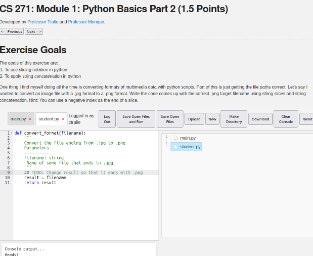
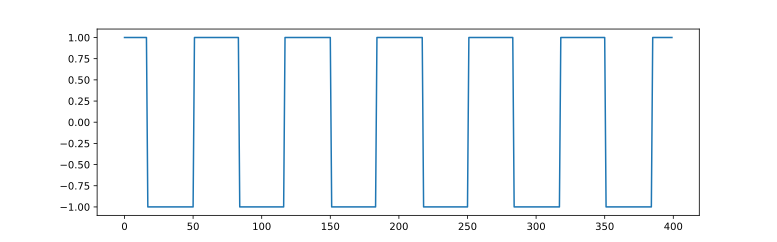
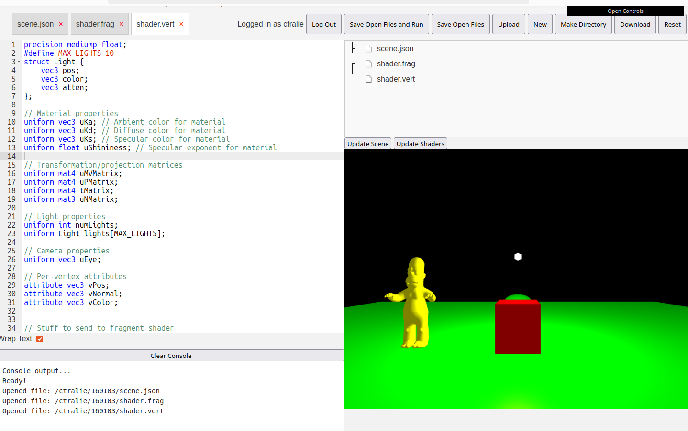
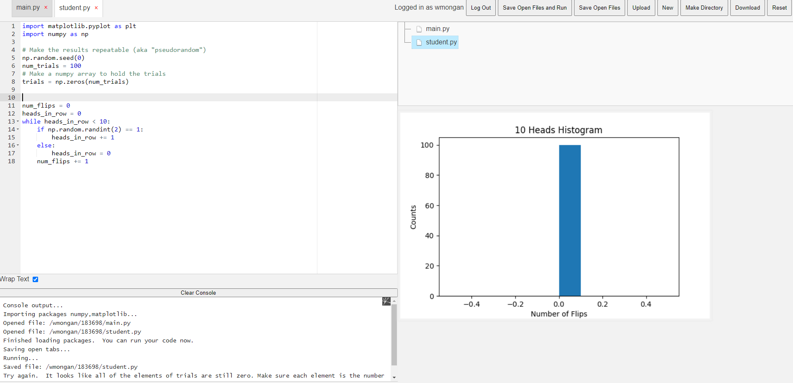

# The Ursinus WebIDE

Christopher Tralie and William Mongan

As a response to emergency remote teaching during the pandemic, we developed an online “live coding” modules system back in 2020, where students write code in a web page where they can run their code, and it is automatically graded. We have been using this extensively across the entire CS curriculum ever since as a “low stakes” medium to teach and reinforce knowledge scaffold up to more difficult assignments. Since the modules run in the browser, they are highly accessible cross-platform without any software installation necessary. The system is also setup to be “client side” on static web pages, which means that the code the students are exploring runs on student’s computers, making the system much easier and cheaper to maintain; in fact, this even enables us to make the exercises available to anyone on the internet at no additional cost. 

Our system addresses the following goals that we had in providing rapidly developed, low-stakes, frequent practice problems for our students, that have continued to enhance the student experience in the post-pandemic classroom:

1. Create a unified code template across all languages we currently support (C++, Java, Javascript, WebGL, Python, Numpy, R, SQL).
2. Remember students netid in a cookie so they don’t have to keep entering it, and add functionality to save/load code if they want to return to it.
3. Devise a simpler way to communicate with Canvas that is easier to maintain.
4. Setup a more intuitive file browser in the module web pages that shows students what files they can edit for each module.  Mirror the filesystem experience they would expect on their local computers to help scaffold a tree-based filesystem.
5. Handle infinite loops that students accidentally create in a more graceful way (currently this freezes up the browser).
6. Provide the illusion of a filesystem within the web development interface that provides students with experience and confidence in using modern development tools and non-mobile filesystems.
7. Seamlessly display multimedia assets within the environment, such as images and audio, to support courses that entail multimedia development and processing.
8. Provide low-stakes automated feedback to students by automatically detecting common mistakes and providing feedback in a more authentic “console-like” window
9. Save student work within the browser, so that students can review their work at a later time by revisiting the exercise page.
10. Perform all of the above without requiring student installation of software beyond an off-the-shelf web browser, regardless of operating system or computing environment constraints; specifically, software modules function on lower-end systems such as Chromebooks.  This is especially helpful as an equity assurance for students who add the class late and need time to install requisite software, and for students who suffer technology breakdowns during the semester.
11. Provide an archive of and automatic grading of student submissions that can connect to learning management systems (LMS) in an encrypted, FERPA-complaint way.

These modules engage students and get them to think about topics outside of class in a much more active way than if we simply assigned readings, particularly with instant feedback we give them that often includes hints relevant to the mistakes they make. The modules are also very dynamic and flexible, so there are lots of exercises we can do with multimedia, etc. The infrastructure also serves as a backup option the first couple of weeks of class while students are still getting software setup on their own computers. Finally, there is a subset of students who have consistently told us that they get more out of these than class because they can go through them at their own pace, and we often use them to keep students on track who are traveling for sports, etc.  Since these are freely available open source online, anyone on the internet can try them.  An example of the student interface is shown below:



## Student-facing features

The IDE layout (`_layouts/exercise.html`) ships a number of UX, accessibility,
and debugging helpers that work on every supported language. None of them
require any change to existing exercise pages — they appear automatically.

### Preferences (View menu)

Open **View** in the menu bar to access three preferences. All choices persist
across reloads in `localStorage` under the key `webide.prefs`.

| Item | What it does |
|---|---|
| **Theme** | Cycles **Dark → Light → High Contrast → Dark…**. The light theme reflows the entire IDE — including ACE syntax tokens — to a light palette. High Contrast is a low-vision-friendly black/white/gold scheme with gold focus rings. |
| **Font Size** | Cycles through `11, 12, 13, 14, 16, 18, 20, 24` px and re-applies to every ACE editor instance. You can also press `Ctrl+=` to increase and `Ctrl+-` to decrease (each press persists). |
| **Reading Mode** | Toggles a **Dyslexia-Friendly** mode that prefers the OpenDyslexic / Atkinson Hyperlegible fonts (with a Comic-Sans/Verdana fallback so it works offline), increases letter-spacing, word-spacing, and line-height in editor + UI text. |

### Keyboard-shortcut overlay (`?`)

Press `?` (or pick **Help → Keyboard Shortcuts**) to open a modal listing every
shortcut. `Esc` closes it. The overlay is focus-trapped for keyboard users and
returns focus to wherever you came from. Inside text fields, `?` types a literal
question mark — press `Esc` first if you want to summon the overlay.

### Responsive / compact layout

Below ~900 px viewport (e.g. a student reading the exercise on their phone),
the IDE collapses gracefully: the activity bar is hidden, the sidebar narrows,
keyboard-shortcut hints are dropped, and the bottom panel grows to fill the
remaining height.

### Accessibility pass

Every clickable button has an `aria-label`, tab/panel pairs use the ARIA
tablist pattern, the editor exposes `role="group"` with a screen-reader-mode
ACE option, and **all keyboard-driven focus is outlined** in a gold focus
ring via `:focus-visible` — mouse clicks don't produce outline noise.

### "Explain this error" affordance

Whenever student code raises a recognizable runtime error, the line printed to
the Output panel gets an inline **? What does this mean?** button. Clicking it
expands a plain-English explanation drawn from a per-language dictionary
covering common Python, Pyodide, JavaScript, Java, C++, SQL, Scheme and Prolog
errors (e.g. `NameError`, `IndexError`, `NullPointerException`,
`ArrayIndexOutOfBoundsException`, `segmentation fault`, `undefined reference`,
`no such table`, `Unbound variable`, …). The same explanation is also appended
to the **Suggestions** tab so it remains discoverable after the console scrolls.

### Infinite-loop watchdog

Every **Run** click immediately writes a **Running…** banner to the Output
panel explaining how to recover if the tab freezes:

> Running… If the page freezes for more than ~10 seconds, your code may have
> an infinite loop. Your file work is saved automatically — refresh the tab
> (Ctrl/Cmd+R) to recover.

For runtimes that yield to the event loop (worker-based C++, async paths), a
5-second toast and a 15-second console message with a **Reload page** button
also fire. For runtimes that block the main thread (Brython `exec`,
JavaScript `eval`), the upfront banner is the only reliable signal — which is
why it appears before the run starts.

### Inspector (bottom-panel tab)

A new **Inspector** tab next to Terminal / Output / Suggestions hosts three
sub-views, populated automatically after every Run:

- **Variables** — top-level variables defined by the student's code, with
  name, type, and a truncated repr/value.
  - **Python (Brython)**: captured via an injected `locals()` snapshot
    postlude.
  - **Pyodide**: walked from `pyodide.globals` after the run.
  - **JavaScript**: computed by diffing `window` keys before and after `eval`.
  - **Other languages**: shows a friendly empty-state pointing out that
    variable inspection is currently Python/JavaScript-only.
- **Step-Through** — record execution one line at a time with `sys.settrace`,
  then play back with **⏮ ◀ ▶ ⏭** controls. The current line is highlighted
  in the ACE editor and locals at that step appear side-by-side.
  - Click **↻ Step Run** in the Inspector toolbar to opt into the traced
    runner for one run (the normal Run button does NOT install the tracer,
    to keep regular runs fast).
  - **Pyodide** (full CPython) supports stepping completely.
  - **Brython** has partial `sys.settrace` support; if no events were
    captured, a friendly empty-state explains it.
- **Call Tape** — a tree of function calls with arguments and return values.
  Recursion produces nested branches; sequential calls produce siblings;
  exceptions get a ⚡ marker.
  - **Python** (Step Run): recorded automatically via settrace.
  - **JavaScript / Java**: students add markers themselves. Two helpers
    are exposed on `window`:
    - `webideTrace.tap('name', arg1, arg2)` — adds a flat sibling entry.
      Best when you just want to log "did this code run?".
    - `webideTrace.call('name', args…)` placed as the **first line inside a
      function body**, paired with `return webideTrace.return(value)`
      immediately **before every return statement** — produces a nested
      recursion tree. Mismatched pairs are flagged inline with
      `(no .return — try webideTrace.tap() for sibling logging)` and the
      summary line counts unclosed frames.

  - **Profile** *(new)* — per-function call counts and self/total/longest
    times. Populated automatically for **Pyodide** (via `sys.settrace`
    timing) and for any JavaScript / Java run that uses
    `webideTrace.call(...) / webideTrace.return(...)`.
  - **Visualize** *(new)* — pure-SVG renderer that draws each variable in
    the current step (or run-end snapshot) as a colored box. Useful for
    data-structures exercises where seeing the shape of a value matters.

### Gutter breakpoints *(new)*

Click any line number in the editor gutter to drop a red breakpoint. `F9`
toggles a breakpoint on the cursor line. **Run › Clear All Breakpoints**
removes every breakpoint for the page. Breakpoints persist across reloads
in `localStorage` under `webide.breakpoints` and are per-file.

When a run hits a breakpoint, the **Inspector › Step-Through** sub-tab
records the line + locals at that moment, so students can see exactly
what was in scope. Behaviour per runtime:

| Runtime | Semantic |
|---|---|
| **Pyodide** | Real `sys.settrace`-based tracer records only the breakpoint lines (separate from full Step Run mode). |
| **Brython** | Source-instrumentation: a `__webide_bp_py(line, vars())` call is injected before each breakpoint line. |
| **JavaScript / Graphics** | Source-instrumentation: `__webide_bp(line, {…locals})` is injected before each breakpoint line; locals are TDZ-safe via try/catch wrappers. |
| **Scheme** | `(webide-bp N)` injected at each line; registered as a BiwaScheme primitive that records the hit. |
| **SQL** | `-- __BP N` marker comments survive the comment-strip pass; the SQL runner emits a hit with rowcount + column list after each marked statement. |
| **Prolog, Java/Processing** | Synthetic hits emitted at run-start (these runtimes don't accept mid-execution callbacks without rewriting their parser). |
| **C/C++** | `printf("__BP %d\n", line)` injected pre-compile; the runtime worker parses markers out of stdout. |

### Tests panel *(new)*

A **Tests** bottom-tab next to Output / Inspector / Suggestions shows
per-exercise unit tests authored by the instructor in the page
front-matter:

```yaml
processor:
  tests:
    - name: "fact(0) == 1"
      code: "console.log(fact(0))"
      expect: { stdout: "1" }
    - name: "fact(5) doesn't throw"
      code: "fact(5)"
      expect: { throws: false }
```

`expect` accepts `stdout` (regex), `throws` (boolean), `returns` (deep
equality), and `vars` ({name: expectedValue}). Click **▶ Run Tests** or
press `Alt+T` to execute. Failures expand inline with stdout + diff.

### Hint ladder *(new)*

Instructor-authored hints unlock progressively as the student accrues
failed Run attempts:

```yaml
processor:
  hints:
    - after: 1
      text: "Have you defined `n` before using it?"
    - after: 3
      text: "Remember that `range(n)` stops *before* n."
    - after: 5
      text: "Try printing `i` inside your loop to watch it evolve."
```

Hints render in the Instructions panel; the attempt counter is stored
per-exercise in `localStorage.webide.hintCounts`.

### "Show me where I'm stuck" *(new)*

When the watchdog soft-fires at 5 seconds, the Running banner grows a
**Show me where** button. Clicking it jumps the editor to the most
recently traced line (from breakpoint hits, the Pyodide tracer, or JS
instrumentation) and opens the Inspector. Works for every language that
has populated `window.__webide_steps`.

### Color-blind mode *(new)*

**View › Color-Blind Mode** swaps the palette for breakpoint dots and
test pass/fail icons so the meaning carries through grayscale rendering
without conflicting with the high-contrast theme. Persisted as
`webide.prefs.colorblind`.

### Run history *(new)*

**View › Run History…** opens a modal listing the last 20 runs for the
current exercise (pass/fail/error icon, time, file count). Click
**Restore** to open the snapshot's files as read-only `(restored:HH:MM:SS)`
tabs so the live work isn't overwritten. Stored in
`localStorage.webide.runHistory[<exerciseId>]`.

### Submission preflight *(new)*

Before posting code to the autograder / Canvas, a modal runs the tests,
scans for stray `console.log` / `print` debug noise, and flags any
unsaved tabs. Students see ✓/✗ per check with a **Submit anyway** /
**Fix and review** choice. The original `postCode` is preserved
(`window._origPostCode`) so the modal can be bypassed when no issues are
found.

### Offline shell *(new)*

A service worker at the site root caches the IDE shell (HTML + `/assets/*`)
on first visit so the IDE keeps booting on flaky WiFi. Language runtime
bundles (Pyodide, Brython, SWI-Prolog, sql.js, etc.) are network-first
with cache fallback so updates land as soon as you reconnect.

Other helpers also exposed on `window` for in-browser debugging:
`window.logToConsole(msg)`, `window.refreshInspectorFromRun()`,
`window.menuCycleTheme()`, `window.menuShowShortcuts()`,
`window.toggleBreakpointAtCursor()`, `window.clearAllBreakpoints()`,
`window.webideBreakpoints.{get,getForActive,has,toggle}`,
`window.runAllTests()`, `window.menuShowRunHistory()`.

### Test suite

All of the above is exercised by a Playwright-driven test suite in `tests/`
that runs in GitHub Actions on every push and PR. See
[`tests/README.md`](./tests/README.md) for the per-language coverage matrix
and the local instructions.

## Installation Instructions

1. Fork [this repository](https://github.com/BillJr99/Ursinus-WebIDE), and set up Github pages to get a URL.
2. To get started with our pre-made assignment exercises across several undergraduate CS courses (available at [https://github.com/BillJr99/Ursinus-Exercises](https://github.com/BillJr99/Ursinus-Exercises)), simply add and clone our submodule of exercises into your `_pages` directory via `git submodule add https://github.com/BillJr99/Ursinus-Exercises _pages/Exercises`.
3. If you would like to use the Computer Graphics assignments, you can add an additional submodule into the `assets/js/ggslac` directory via `git submodule add https://github.com/ctralie/ggslac.git assets/js/ggslac`.
4. Proceed to the Configuration section below to set a few global parameters for linking to your Learning Management System (LMS)
5. Fork and/or Download the Form Processor ([https://github.com/BillJr99/formprocessor/](https://github.com/BillJr99/formprocessor/)) to configure a Google form/spreadsheet to receive student submissions from the WebIDE front-end, and to post grades and submissions to your LMS in a FERPA-compliant way.  Instructions for configuring the Form Processor can be found on that repository.
6. Create assignments in the `_pages/` directory (details about how to do this are provided below).  We encourage you to submit pull requests back to the **Ursinus-Exercises** git repository to share your work with others!

## Basic Configuration

In `_config.yml`, edit the variables to suit your preferences.  Specifically, be sure to set the following parameters:

```
publickey: |  
  YOUR PUBLIC KEY HERE
```

`canvascourseid: courseid1, courseid2, courseid3`  

`formlink: LINK TO GOOGLE SHEET FOR FORM PROCESSING HERE`  

If desired, these variables can be overrided on a per-assignment or per-page basis from the global values configured here:

* `publickey` can be overridden in the layout 
* `canvascourseid` can be overridden in the exercise page
* `formlink` can be overriden in the layout

You can generate a public and private RSA key for encryption via these commands:

```
openssl genrsa -out private-key.pem 4096
openssl rsa -in private-key.pem -pubout -out public-key.pem
```

And paste the contents of the relevant file when requested in the config file.

## Backend Form Processor for Posting Grades
Use this WebIDE front-end with the formprocessor back-end (available at [https://github.com/BillJr99/formprocessor/](https://github.com/BillJr99/formprocessor/)) to pull from google sheets

## Example Exercises

This repository contains examples for various programming languages. Each example is linked below, organized by language.

### A Gallery of Example Screenshots

<br><br>

<br><br>  


### CS1 and CS2

#### **Java**
- [CS173: Intro to Computer Science - ArrayLists](http://www.billmongan.com/Ursinus-WebIDE/Modules/ArrayLists/Exercise) ([source](https://raw.githubusercontent.com/BillJr99/Ursinus-Exercises/refs/heads/main/Java/exercise-arraylists.md))
- [CS173: Intro to Computer Science - Nearest Value in an Array without Going Over](http://www.billmongan.com/Ursinus-WebIDE/Modules/Arrays/Exercise) ([source](https://raw.githubusercontent.com/BillJr99/Ursinus-Exercises/refs/heads/main/Java/exercise-arrays.md))
- [CS173: Intro to Computer Science - Introduction to Boolean Expressions](http://www.billmongan.com/Ursinus-WebIDE/Modules/Boolean/Exercise) ([source](https://raw.githubusercontent.com/BillJr99/Ursinus-Exercises/refs/heads/main/Java/exercise-boolean.md))
- [CS173: Intro to Computer Science - Introduction to Conditionals](http://www.billmongan.com/Ursinus-WebIDE/Modules/Conditionals/Exercise) ([source](https://raw.githubusercontent.com/BillJr99/Ursinus-Exercises/refs/heads/main/Java/exercise-conditionals.md))
- [CS173: Intro to Computer Science - Dynamic Programming](http://www.billmongan.com/Ursinus-WebIDE/Modules/DynamicProgramming/Exercise) ([source](https://raw.githubusercontent.com/BillJr99/Ursinus-Exercises/refs/heads/main/Java/exercise-dynamicprogramming.md))
- [CS173: Intro to Computer Science - Epoch Time Overflow Calculator](http://www.billmongan.com/Ursinus-WebIDE/Modules/EpochTime/Exercise) ([source](https://raw.githubusercontent.com/BillJr99/Ursinus-Exercises/refs/heads/main/Java/exercise-epoch.md))
- [CS173: Intro to Computer Science - Introduction to Primitive Data Types and Expressions](http://www.billmongan.com/Ursinus-WebIDE/Modules/Expressions/Exercise) ([source](https://raw.githubusercontent.com/BillJr99/Ursinus-Exercises/refs/heads/main/Java/exercise-expressions.md))
- [CS173: Intro to Computer Science - Introduction to Primitive Data Types and Expressions Revisited](http://www.billmongan.com/Ursinus-WebIDE/Modules/Expressions/Exercise2) ([source](https://raw.githubusercontent.com/BillJr99/Ursinus-Exercises/refs/heads/main/Java/exercise-expressions.md))
- [CS173: Intro to Computer Science - Four in a Row](http://www.billmongan.com/Ursinus-WebIDE/Modules/FourInARow/Exercise) ([source](https://raw.githubusercontent.com/BillJr99/Ursinus-Exercises/refs/heads/main/Java/exercise-fourinarow.md))
- [CS173: Intro to Computer Science - Functions](http://www.billmongan.com/Ursinus-WebIDE/Modules/Functions/Exercise) ([source](https://raw.githubusercontent.com/BillJr99/Ursinus-Exercises/refs/heads/main/Java/exercise-functions.md))
- [CS173: Intro to Computer Science - Introduction to the IDE](http://www.billmongan.com/Ursinus-WebIDE/Modules/IDE/Exercise) ([source](https://raw.githubusercontent.com/BillJr99/Ursinus-Exercises/refs/heads/main/Java/exercise-ide.md))
- [CS173: Intro to Computer Science - Insertion Sort](http://www.billmongan.com/Ursinus-WebIDE/Modules/InsertionSort/Exercise) ([source](https://raw.githubusercontent.com/BillJr99/Ursinus-Exercises/refs/heads/main/Java/exercise-insertionsort.md))
- [CS173: Intro to Computer Science - Introduction to Iteration](http://www.billmongan.com/Ursinus-WebIDE/Modules/Iteration/Exercise) ([source](https://raw.githubusercontent.com/BillJr99/Ursinus-Exercises/refs/heads/main/Java/exercise-iteration.md))
- [CS173: Intro to Computer Science - Iteration Revisited](http://www.billmongan.com/Ursinus-WebIDE/Modules/Iteration/Exercise2) ([source](https://raw.githubusercontent.com/BillJr99/Ursinus-Exercises/refs/heads/main/Java/exercise-iteration.md))
- [CS173: Intro to Computer Science - Merge Sort](http://www.billmongan.com/Ursinus-WebIDE/Modules/MergeSort/Exercise) ([source](https://raw.githubusercontent.com/BillJr99/Ursinus-Exercises/refs/heads/main/Java/exercise-mergesort.md))
- [CS173: Intro to Computer Science - Recursion](http://www.billmongan.com/Ursinus-WebIDE/Modules/Recursion/Exercise) ([source](https://raw.githubusercontent.com/BillJr99/Ursinus-Exercises/refs/heads/main/Java/exercise-recursion.md))
- [CS173: Intro to Computer Science - Strings](http://www.billmongan.com/Ursinus-WebIDE/Modules/Strings/Exercise) ([source](https://raw.githubusercontent.com/BillJr99/Ursinus-Exercises/refs/heads/main/Java/exercise-strings.md))
- [CS173: Intro to Computer Science - Strings Revisited](http://www.billmongan.com/Ursinus-WebIDE/Modules/Strings/Exercise2) ([source](https://raw.githubusercontent.com/BillJr99/Ursinus-Exercises/refs/heads/main/Java/exercise-strings.md))
- [CS173: Intro to Computer Science - Tic-Tac-Toe](http://www.billmongan.com/Ursinus-WebIDE/Modules/TicTacToe/Exercise) ([source](https://raw.githubusercontent.com/BillJr99/Ursinus-Exercises/refs/heads/main/Java/exercise-tictactoe.md))
- [CS174: OOP - Drills - Array 3 Sort](http://www.billmongan.com/Ursinus-WebIDE/ArrayDrills/Array3Sort) ([source](https://raw.githubusercontent.com/BillJr99/Ursinus-Exercises/refs/heads/main/Java/exercise-drill-array3sort.md))
- [CS174: OOP - Drills - Array Insert](http://www.billmongan.com/Ursinus-WebIDE/ArrayDrills/ArrayInsert) ([source](https://raw.githubusercontent.com/BillJr99/Ursinus-Exercises/refs/heads/main/Java/exercise-drill-arrayinsert.md))
- [CS174: OOP - Drills - Computing the mean of arrays](http://www.billmongan.com/Ursinus-WebIDE/ArrayDrills/ArrayMean) ([source](https://raw.githubusercontent.com/BillJr99/Ursinus-Exercises/refs/heads/main/Java/exercise-drill-arraymean.md))
- [CS174: OOP - Drills - Array Min Index](http://www.billmongan.com/Ursinus-WebIDE/ArrayDrills/ArrayMinIndex) ([source](https://raw.githubusercontent.com/BillJr99/Ursinus-Exercises/refs/heads/main/Java/exercise-drill-arrayminindex.md))
- [CS174: OOP - Drills - Creating the reverse of an array](http://www.billmongan.com/Ursinus-WebIDE/ArrayDrills/ArrayReverse) ([source](https://raw.githubusercontent.com/BillJr99/Ursinus-Exercises/refs/heads/main/Java/exercise-drill-arrayreverse.md))
- [CS174: OOP - Drills - Printing array with commas](http://www.billmongan.com/Ursinus-WebIDE/ArrayDrills/ArraySep) ([source](https://raw.githubusercontent.com/BillJr99/Ursinus-Exercises/refs/heads/main/Java/exercise-drill-arraysep.md))
- [CS174: OOP - Drills - Counting Array Zeroes](http://www.billmongan.com/Ursinus-WebIDE/ArrayDrills/ArrayZeroes) ([source](https://raw.githubusercontent.com/BillJr99/Ursinus-Exercises/refs/heads/main/Java/exercise-drill-arrayzeroes.md))
- [CS174: OOP - Drills - Vowel Counting](http://www.billmongan.com/Ursinus-WebIDE/MiscDrills/StringVowels) ([source](https://raw.githubusercontent.com/BillJr99/Ursinus-Exercises/refs/heads/main/Java/exercise-drill-stringvowels.md))

#### **C++**
- [C++ Basics](http://www.billmongan.com/Ursinus-WebIDE/Modules/Cpp/CppIntro) ([source](https://raw.githubusercontent.com/BillJr99/Ursinus-Exercises/refs/heads/main/cpp/exercise-cppintro.md))
- [CS174: Module 14: Recursive Binary Search](http://www.billmongan.com/Ursinus-WebIDE/Modules/Cpp/BinarySearch) ([source](https://raw.githubusercontent.com/BillJr99/Ursinus-Exercises/refs/heads/main/cpp/exercise-cppbinarysearch.md))
- [CS174: Module 12: C++ Inheritance Exercise 1](http://www.billmongan.com/Ursinus-WebIDE/Modules/Cpp/Inheritance1) ([source](https://raw.githubusercontent.com/BillJr99/Ursinus-Exercises/refs/heads/main/cpp/exercise-cppinheritance.md))
- [CS174: Linked List: addFirst()](http://www.billmongan.com/Ursinus-WebIDE/Modules/Cpp/LinkedListAddFirst) ([source](https://raw.githubusercontent.com/BillJr99/Ursinus-Exercises/refs/heads/main/cpp/exercise-cpplinkedlist.md))
- [CS174: Merge Sort Exercise](http://www.billmongan.com/Ursinus-WebIDE/Modules/Cpp/Merge) ([source](https://raw.githubusercontent.com/BillJr99/Ursinus-Exercises/refs/heads/main/cpp/exercise-cppmerge.md))
- [CS174: Pointer Fundamentals Module: Exercise 1](http://www.billmongan.com/Ursinus-WebIDE/Modules/Cpp/PointerSwap) ([source](https://raw.githubusercontent.com/BillJr99/Ursinus-Exercises/refs/heads/main/cpp/exercise-cpppointerswap.md))
- [CS174: Module 12: C++ Inheritance Exercise 2](http://www.billmongan.com/Ursinus-WebIDE/Modules/Cpp/Polymorphism) ([source](https://raw.githubusercontent.com/BillJr99/Ursinus-Exercises/refs/heads/main/cpp/exercise-cpppolymorphism.md))
- [CS174: STL List Class Exercise](http://www.billmongan.com/Ursinus-WebIDE/Modules/Cpp/STLList) ([source](https://raw.githubusercontent.com/BillJr99/Ursinus-Exercises/refs/heads/main/cpp/exercise-cppstllist.md))
- [CS174: Module 15: Binary Trees Inorder Traversal](http://www.billmongan.com/Ursinus-WebIDE/Modules/Cpp/TreeInorder) ([source](https://raw.githubusercontent.com/BillJr99/Ursinus-Exercises/refs/heads/main/cpp/exercise-cpptreeinorder.md))

#### **Javascript**
- [Javascript Example Module: Array Min Index](http://www.billmongan.com/Ursinus-WebIDE/Modules/Javascript/MinIndex) ([source](https://raw.githubusercontent.com/BillJr99/Ursinus-Exercises/refs/heads/main/Javascript/exercise-minindex.md))

#### **Python**
- [CS377: Database Design - Iteration in Python](http://www.billmongan.com/Ursinus-WebIDE/Modules/Python/Iteration/Exercise) ([source](https://raw.githubusercontent.com/BillJr99/Ursinus-Exercises/refs/heads/main/Python/exercise-python-iteration.md))
- [CS377: Database Design - Quadratic Formula in Python](http://www.billmongan.com/Ursinus-WebIDE/Modules/Python/Warmup/Exercise) ([source](https://raw.githubusercontent.com/BillJr99/Ursinus-Exercises/refs/heads/main/Python/exercise-python-quadratic.md))
- [CS 271: Module 1: Python Basics Part 2](http://www.billmongan.com/Ursinus-WebIDE/Modules/Python/Slice/Exercise) ([source](https://raw.githubusercontent.com/BillJr99/Ursinus-Exercises/refs/heads/main/Python/exercise-python-slice.md))
- [CS 372: Module 2: Square Wave](http://www.billmongan.com/Ursinus-WebIDE/Modules/Pyodide/AudioSquareWave) ([source](https://raw.githubusercontent.com/BillJr99/Ursinus-Exercises/refs/heads/main/Pyodide/exercise-pyodide-audio-squarewave.md))
- [CS 477: Module 1: Numpy Exercise](http://www.billmongan.com/Ursinus-WebIDE/Modules/Pyodide/PlotTenHeads) ([source](https://raw.githubusercontent.com/BillJr99/Ursinus-Exercises/refs/heads/main/Pyodide/exercise-pyodide-plot-tenheads.md))

### Principles of Programming Languages
#### **Prolog**
- [CS374: Principles of Programming Languages - Warmup with Prolog](http://www.billmongan.com/Ursinus-WebIDE/Modules/Prolog/Warmup/Exercise) ([source](https://raw.githubusercontent.com/BillJr99/Ursinus-Exercises/refs/heads/main/Prolog/exercise-prolog-warmup.md))
- [CS374: Principles of Programming Languages - Warmup with Prolog Part 2](http://www.billmongan.com/Ursinus-WebIDE/Modules/Prolog/Warmup/Exercise2) ([source](https://raw.githubusercontent.com/BillJr99/Ursinus-Exercises/refs/heads/main/Prolog/exercise-prolog-warmup.md))

#### **Scheme**
- [CS374: Principles of Programming Languages - Warmup with Scheme](http://www.billmongan.com/Ursinus-WebIDE/Modules/Scheme/Warmup/Exercise) ([source](https://raw.githubusercontent.com/BillJr99/Ursinus-Exercises/refs/heads/main/Scheme/exercise-scheme-warmup.md))

### Statistics
#### **R**
- [CS173: Intro to Computer Science - R (from WebR)](http://www.billmongan.com/Ursinus-WebIDE/Modules/R/TutorialExercise) ([source](https://raw.githubusercontent.com/BillJr99/Ursinus-Exercises/refs/heads/main/R/exercise-r.md))
- [CS173: Intro to Computer Science - R Quadratic Equation (from WebR)](http://www.billmongan.com/Ursinus-WebIDE/Modules/R/QuadraticExercise) ([source](https://raw.githubusercontent.com/BillJr99/Ursinus-Exercises/refs/heads/main/R/exercise-rquadratic.md))

### Database Systems with SQL
- [CS377: Database Design - SQL Aggregation](http://www.billmongan.com/Ursinus-WebIDE/Modules/SQL/Aggregation/Exercise) ([source](https://raw.githubusercontent.com/BillJr99/Ursinus-Exercises/refs/heads/main/SQL/exercise-sql-aggregation.md))
- [CS377: Database Design - SQL Joins](http://www.billmongan.com/Ursinus-WebIDE/Modules/SQL/Join/Exercise) ([source](https://raw.githubusercontent.com/BillJr99/Ursinus-Exercises/refs/heads/main/SQL/exercise-sql-join.md))
- [CS377: Database Design - Introduction to Databases](http://www.billmongan.com/Ursinus-WebIDE/Modules/SQL/Warmup/Exercise) ([source](https://raw.githubusercontent.com/BillJr99/Ursinus-Exercises/refs/heads/main/SQL/exercise-sql-warmup.md))

### **Computer Graphics**
- [CS 476: Computer Graphics - Module 10 Exercise 1](http://www.billmongan.com/Ursinus-WebIDE/Modules/Graphics/IlluminationLambertian) ([source](https://raw.githubusercontent.com/BillJr99/Ursinus-Exercises/refs/heads/main/Graphics/exercise-shader-lambertian.md))
- [CS 476: Computer Graphics - Object First Perspective/Viewing Exercise 1](http://www.billmongan.com/Ursinus-WebIDE/Modules/Graphics/ViewOrthographic) ([source](https://raw.githubusercontent.com/BillJr99/Ursinus-Exercises/refs/heads/main/Graphics/exercise-view-orthographic.md))

## Assignment Language Specific Notes

### Pyodide Modules

In the markdown files for the modules you're creating, be sure to specify the <code>packages</code> field nested under <code>info</code> to load the packages that are necessary for the module.  For instance, for a module that creates a plot in matplotlib, you'd say

<code>packages: "numpy,matplotlib"</code>

After creating a plot, use the built-in method <code>save_figure_js()</code> in your main code in python to save the figure to the figure area.  You can also then look at the string <code>audioStr</code> in the command line to extract the base64 binary code for the image to create reference solutions

When creating an audio module, use the built-in method 

<code>save_audio_js(y, sr)</code>

which takes in an array of samples and a sample rate.  Then check the global string <code>audioStr</code> for the base64 binary to create reference solutions


### Graphics Modules

The graphics modules are a bit complicated.  My recommendation is to look at the examples exercise-shader-lambertian and exercise-view-orthographic for examples, and to build off of those examples.

As with the pyodide plots, you can do correctness checks by comparing a base64 encoded version of what's rendered to some reference base64 string.  The current output is in the variable <code>canvasStr</code>.  So, for example, if I wanted to compare the current output to some string called <code>correctStr</code>, then I could say the following in <code>feedbackprocess</code>

<code>let isCorrect = await pngImagesEqualTol(canvasStr, correctStr, DEFAULT_TOL, "correctCheck");</code>

Then, my correctcheck could simply be

<code>correctcheck: isCorrect</code>

One thing that's different here from a direct comparison is that, due to slight variations in graphics hardware, the results will be slightly different pixel to pixel.  Therefore, the method <code>pngImagesEqualTol</code> actually does a pixel by pixel Euclidean distance calculation between the two images, and it will return <code>true</code> as long as the distance is less than some tolerance (specified as the third argument).  You can change this tolerance, but I've provided a value <code>DEFAULT_TOL</code> that I found worked well for students in the past.

#### Other notes:
Be sure that the relative paths for all meshes in `assets/js/ggslac/meshes` are correct based on how deep the module is.  For example, in the homer mesh in exercise1-orthographic, we say

```
"filename":"../../assets/js/ggslac/meshes/homer.off"
```

since that module is in `/Modules/Graphics/OrthographicView`

## Creating Your Own Exercises 

If you'd rather not hand-edit YAML, visit `/Educator/` on your deployed site (or http://localhost:4000/Educator/ when running `bundle exec jekyll serve` locally). The Educator authoring tool gives you a form-driven UI for every field documented below, an ACE editor with starter recipes for the JavaScript correctness checks, a rich-text editor for the instructions HTML, and optional GitHub sync (paste a fine-grained Personal Access Token, edit `.md` files in place, commit or open a pull request) — all without touching the raw markdown.

To create an exercise by hand, create a Markdown page in your `_pages` directory using the following template.  Items you fill in are denoted with the `<<` and `>>` characters (which you should remove when filling in your desired data!).  Replace the other items to your preferences.

```
---
layout: exercise
permalink: <<your relative URL here - for example, /Modules/ArrayLists/Exercise>>
title: "<<title here - for example, CS173: Intro to Computer Science - ArrayLists>>"
language: "<<language here - one of the follwoing: java, javascript, cpp, python, pyodide, sql, scheme, prolog, graphics_view, grpahics_shader>>"


info:
  points: 3
  instructions: "Modify the Driver.java file to create an <code>ArrayList</code> containing all prime numbers between 0 and <code>n</code>."
  goals:
    - "To create and manipulate an <code>ArrayList</code>"
    - "To iterate over an <code>ArrayList</code>"
  
canvasasmtid: "<<Your corresponding Canvas gradebook assignment ID: for example, 137462>>"
canvaspoints: 3
  
processor:  
  correctfeedback: "Correct!!" 
  incorrectfeedback: "Try again"
  submitformlink: false
  feedbackprocess: | 
    <<instructions on how to parse the console response for correctness - for example, let ans = feedbackString.split("-");>>
  correctcheck: |
    <<a boolean check for correctness suitable for use in an if statement - for example, ans[0] === "7" && ans[1] === "25">>
  <<optionally, add one or more checks for common incorrect answers with targeted hints and feedback>>
  incorrectchecks:
    - incorrectcheck: |
        ans.length == 1
      feedback: "Try again: you've found one of the prime numbers, keep iterating with your loop to find the other!"

<<your files and student code appear below, which will populate a file tree.  One file should be main, and instructor files can be marked read-only or even invisible.>>      
files: 
  - filename: "PrimeArray.java"
    name: primearray
    ismain: false
    isreadonly: false
    isvisible: true
    code: | 
        import java.util.ArrayList;
        
        public class PrimeArray {
            public static boolean isPrime(int val) {
                for(int i = 2; i <= Math.sqrt(val); i++) {
                    if(val % i == 0) {
                        return false;
                    }
                }
                
                return true;
            }
            
            public static ArrayList<Integer> buildArrayOfPrimes(int n) {
                /* TODO: Create an ArrayList of Integer values */
                
                /* TODO: iterate from 2 to n */
                
                    /* TODO: if each number is prime, add it to the ArrayList */
                
                /* TODO: return the ArrayList */
            }
        }
  - filename: "Driver.java"
    name: driver
    ismain: false
    isreadonly: true
    isvisible: true
    code: | 
        public class Driver {            
            public static void main(String[] args) {
                ArrayList<Integer> primes = PrimeArray.buildArrayOfPrimes(100);
                System.out.print(primes.get(3) + "-" + primes.size());
            }
        }    

  - filename: "Excerpt from Main.java: body of main() function"
    ismain: true
    name: main
    isreadonly: true
    isvisible: false
    code: |
        Driver.main(null);

openFilesOnLoad: ["PrimeArray.java"]       
---
```
